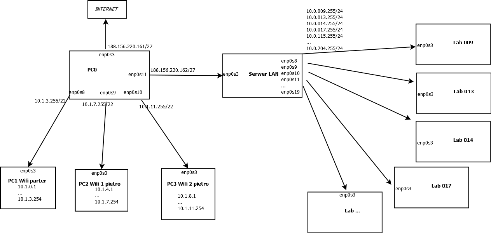

Potrzebna sieć wifi na każdym piętrze, czyli 3 sieci z maskami 22, ponieważ min. 800 urządzeń
Dla każdego laboratorium maska 24, mogłaby być 26 czyli dla 62 urządzeń, min. potrzeba 35.
'Każde laboratorium posiada oddzielną podsieć pozwalającą efektywnie zidentyfikować urządzania
kondygnacja oraz sala' - aby zidentyfikować salę, 3 oktet adresu odpowiada numerowi sali.
Do adresowania stanowisk i urządzeń podpiętych na wifi wykorzystuję pulę adresów prywatnych, CIDR: 10.0.0.0/8

