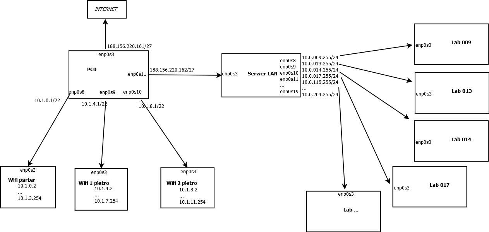

Potrzebna sieć wifi na każdym piętrze, czyli 3 sieci z maskami 22, ponieważ min. 800 urządzeń
Dla każdego laboratorium maska 24, mogłaby być 26 czyli dla 62 urządzeń, min. potrzeba 35.
Ponieważ w puli adresów publicznych dostępne jest tylko 30 adresów, do adresowania stanowisk i urządzeń podpiętych na wifi wykorzystuję pulę adresów prywatnych, CIDR: 10.0.0.0/8

Właściwe adresy:
  - 188.156.220.161/27 połączenie z internetem
  - 10.1.0.0/22 wifi parter
  - 10.1.4.0/22 wifi pietro 1
  - 10.1.8.0/22 wifi pietro 2
  - Laboratoria - aby zidentyfikować salę i kondygnację, 3 oktet adresu odpowiada numerowi sali:
    - 009: 10.0.9.0/24
    - 013: 10.0.13.0/24
    - 014: 10.0.14.0/24
    - 017: 10.0.17.0/24
    - 115: 10.0.115.0/24
    - 116: 10.0.116.0/24
    - 117: 10.0.117.0/24
    - 122: 10.0.122.0/24
    - 201: 10.0.201.0/24
    - 202: 10.0.202.0/24
    - 203: 10.0.203.0/24
    - 204: 10.0.204.0/24
    

  Konfiguracja:
  PC0 (Główny router)
    enp0s3: internet
    enp0s8 (wifi parter)
      address 10.1.0.0
      netmask 255.255.252.0
    enp0s9 (wifi piętro 1)
      address 10.1.4.0
      netmask 255.255.252.0
    enp0s10 (wifi piętro 2)
      address 10.1.8.0
      netmask 255.255.252.0
    enp0s11 (Serwer LAN)
      address 188.156.220.162
      netmask 255.255.255.224
  
  Serwer LAN
    enp0s3
      address 188.156.220.163
      netmask 255.255.255.224
    enp0s8
      address 10.0.9.255
      netmask 255.255.255.0
    enp0s9
      address 10.0.13.255
      netmask 255.255.255.0
    ...
    (analogicznie dla pozostałych labów)
    ...
    enp0s19
      address 10.0.204.255
      netmask 255.255.255.0

  DHCP i DNS:
  dla każdego WIFI anagolicznie (parter):
      nano /etc/default/isc-dhcp-server 
        odkomentować ścieżkę do pliku config DHCPDv4_CONF
        dopisać interfejs INTERFACESv4="enp0s10"
      nano /etc/dhcp/dhcpd.conf - dopisać konfiguracje sieci :
        subnet 188.156.224.0 netmask 255.255.252.0 {
          range 188.156.224.2 188.156.227.254;
          option routers 188.156.224.1;
          option domain-name-servers 1.1.1.1, 1.0.0.1;
        }
      systemctl restart isc-dhcp-server

